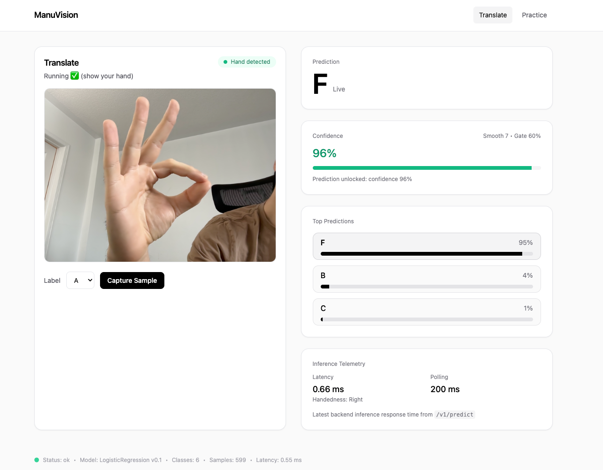
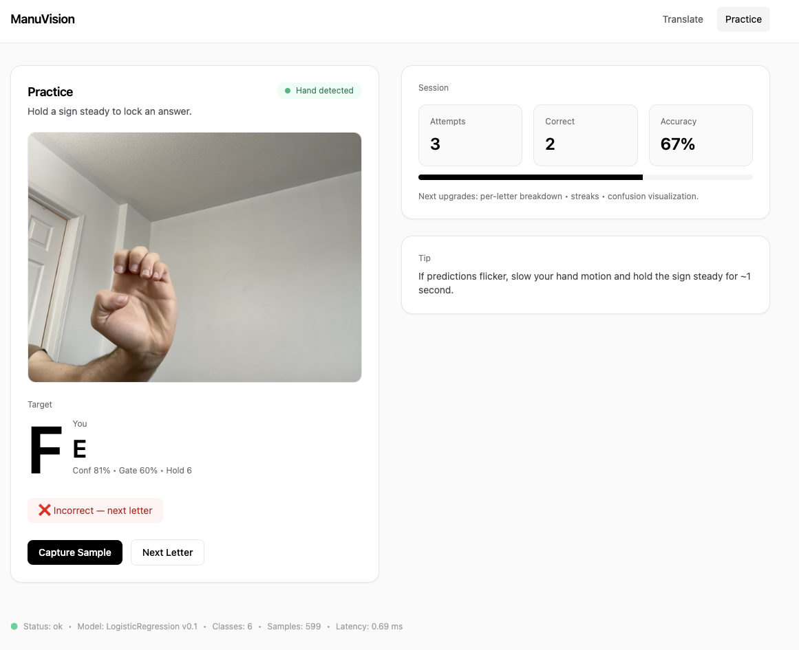

# ManuVision

**ManuVision** is a full-stack sign language recognition system that demonstrates a **production-style machine learning workflow**:

data collection → feature engineering → model training → real-time inference

The system captures hand landmarks using MediaPipe, transforms them into normalized features, and performs real-time ASL letter prediction through a deployed FastAPI inference service.

---

# Live Demo

Frontend (Vercel)  
https://manuvision.vercel.app

Backend API  
https://manuvision.onrender.com

API Docs  
https://manuvision.onrender.com/docs

---

## Demo

### Translate Mode

Real-time ASL letter recognition with probability visualization and inference telemetry.



### Practice Mode

Interactive training mode with attempt tracking, accuracy statistics, and stable prediction detection.


------------------------------------------------------------------------

# Current Capabilities

## Core ML

- MediaPipe-based 21-point 3D hand landmark tracking
- Translation & scale-invariant feature normalization
- Handedness-aware canonicalization (left hands mirrored to right-hand space)
- 63-dimensional wrist-centered feature vector
- Multiclass Logistic Regression classifier
- Stratified train/test split
- Confusion matrix + classification report
- Model persistence via `joblib`

Current trained classes:
```
A–F
```
## Real-Time Inference

- FastAPI backend serving predictions
- Frontend prediction polling (~5 FPS)
- Rolling probability smoothing
- Confidence gating (threshold-based unlock)
- Top-3 prediction probability visualization
- Live inference telemetry (latency + polling rate)

## Observability

The system exposes runtime model information for debugging and monitoring.

Backend endpoint:

GET /health

Returns:

- model version
- loaded classifier type
- supported classes
- dataset sample count
- backend inference latency

Frontend displays:

- live prediction confidence
- inference latency
- polling rate
- model metadata
- tracker status
- handedness detection

---

## UI Modes

### Translate Mode

- Live prediction display
- Confidence visualization
- Top-3 prediction probabilities
- Confidence gating (prevents unstable predictions)
- Dataset capture & labeling
- Handedness-aware inference

---

### Practice Mode

- Target → Attempt → Lock-in evaluation
- Stable prediction detection
- One-attempt-per-round evaluation
- Session tracking (attempts, accuracy)
- Real-time camera reuse (shared MediaPipe pipeline)

Note:
Practice mode only samples from letters currently supported by the trained model.

---

## Architecture Improvements

- Centralized `HandTracker` component
- Shared camera stream across pages
- Single MediaPipe lifecycle
- Handedness-aware feature canonicalization
- Observability-ready UI layout

---

## Current Dataset

- ~600 labeled samples
- Balanced across A–F classes
- Stored in Postgres and exported to NDJSON for training

------------------------------------------------------------------------

# ML Pipeline

## Feature Engineering

Each frame produces 21 3D landmarks.

Preprocessing pipeline:

1. **Translation invariance**
   - Subtract wrist landmark (LM0)

2. **Scale invariance**
   - Normalize by wrist → middle MCP distance (LM0 → LM9)

3. **Handedness canonicalization**
   - Left hands are mirrored to match right-hand coordinate space

4. **Flatten**
   - 21 × 3 → 63-dimensional feature vector

This makes predictions robust to:

- Camera position
- Hand distance
- Minor translations
- Left vs right hand usage

------------------------------------------------------------------------

# Model

- Logistic Regression (multiclass)
- Probability outputs used for smoothing
- Rolling window averaging (frontend)
- Confidence threshold gating
- Top-k probability exposure for UI debugging

Artifacts:
```
backend/models/

model.joblib  
metadata.json
```

------------------------------------------------------------------------

# System Architecture

```
User Camera
     │
     ▼
MediaPipe Hand Tracking
     │
     ▼
Feature Engineering
(translation + scale normalization)
     │
     ▼
FastAPI Inference Service
(Render)
     │
     ▼
Logistic Regression Model
     │
     ▼
Prediction + Confidence Scores
     │
     ▼
Frontend Visualization (Vercel)
```

### Frontend

- React (Vite)
- TailwindCSS
- MediaPipe Hands
- Centralized HandTracker
- Prediction smoothing + gating
- Translate + Practice UI modes

---

### Backend

- FastAPI
- SQLAlchemy ORM
- Pydantic validation

Endpoints:

- POST /v1/predict
- POST /v1/samples
- POST /v1/attempts

- GET /v1/samples/export
- GET /v1/samples/stats
- GET /v1/samples/recent

- GET /health

---

### Database

Production database is hosted on Neon (serverless Postgres).

Local development uses Dockerized Postgres.

Tables:

`samples`
- aggregated landmarks
- label
- handedness
- session id

`attempts`
- target label
- predicted label
- confidence
- correctness
- session id

------------------------------------------------------------------------

# Project Structure
```
manuvision/
│
├── frontend/
│   └── src/
│       ├── components/
│       │   ├── HandTracker.jsx
│       │   └── Layout.jsx
│       ├── pages/
│       │   ├── Translate.jsx
│       │   └── Practice.jsx
│       └── App.jsx
│
├── backend/
│   ├── app/
│   │   ├── api/
│   │   ├── core/
│   │   ├── ml/
│   │   │   ├── features.py
│   │   │   └── model.py
│   │   └── main.py
│   │
│   ├── scripts/
│   │   └── train.py
│   │
│   └── models/
│
├── docker-compose.yml
└── README.md
```
------------------------------------------------------------------------

# Setup

## 1. Clone
```
git clone `https://github.com/Anv-it/manuvision`{=html} 
cd manuvision
```
## 2. Start Postgres
```
docker compose up -d
```
## 3. Backend
```
cd backend 
python -m venv .venv 
source .venv/bin/activate 
pip install -r requirements.txt 
uvicorn app.main:app --reload
```
Runs on: http://localhost:8000

## 4. Frontend
```
cd frontend 
npm install 
npm run dev
```
Runs on: http://localhost:5173

------------------------------------------------------------------------

# Training Workflow

1. Capture labeled samples via **Translate Mode**

2. Train model
```
python -m backend.scripts.train
```
The training script automatically:

- Fetches the latest dataset from the API  
- Saves a fresh NDJSON snapshot to `backend/data/samples.ndjson`  
- Trains classifier
- Writes updated artifacts to `backend/models/`

3. Restart backend

Reload the API to use the updated model.


------------------------------------------------------------------------

# Health Check
```
curl http://localhost:8000/health
```
Returns:
```
{
"status": "ok",
"model_name": "LogisticRegression",
"model_version": "0.1",
"classes": ["A","B","C","D","E","F"],
"samples": 599
}
```
------------------------------------------------------------------------

# Roadmap

### ML

- Full ASL alphabet coverage (A–Z)
- Per-letter performance tracking
- Confusion matrix visualization dashboard
- Model retraining from UI
- Alternative models (Random Forest / XGBoost)

### Product

- Dark mode
- Mobile optimization
- Dataset management UI
- Export dataset from browser

### Research

- Dynamic sign recognition
- Temporal models (LSTM / TCN)
- Gesture sequence recognition